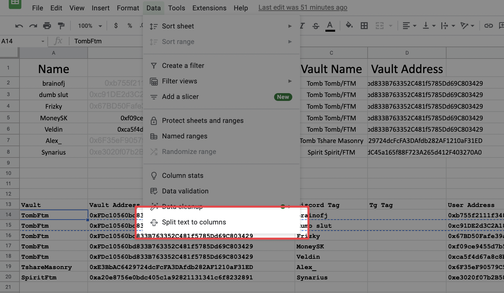

# Grim User Pre Exploit Shares
Made in solidarity by Architect

# Setup
```
yarn install
```

**Add Vault:**
1. Add Vault to VaultNames list in `scripts/types.ts`
2. Create entry and add Vault data in `scripts/vaultData.ts`
3. (If Necessary): Get ABI from ftmscan and paste into new .json entry in `scripts/abi`, add to exported abis in `scripts/abi/abi.ts`
4. Get pre exploit full price per share: Add vault address to tenderly.co. Simulate a `getFullPricePerShare()` on that contract with specific block number: `25345003` (This is the block before the first exploit was executed)

**Add Users:**
1. (If Necessary): Create entry for new vault in `scripts/affectedUsers` and add to exported affected users object in `scripts/affectedUsers/affectedUsers.ts`
2. Add list of users to `AffectedUsersCollection` with their discord / tg tag. TS will ensure you are adding in the correct format

# Use
Run:
```
yarn users-pre-exploit-shares
```

# Output
Output is put into `output.csv` in a CSV format.

Output values are in decimal format (assuming 18 decimals for all tokens)

To add CSV records to a google sheet, PASTE, select pasted cell, and split text into columns:

